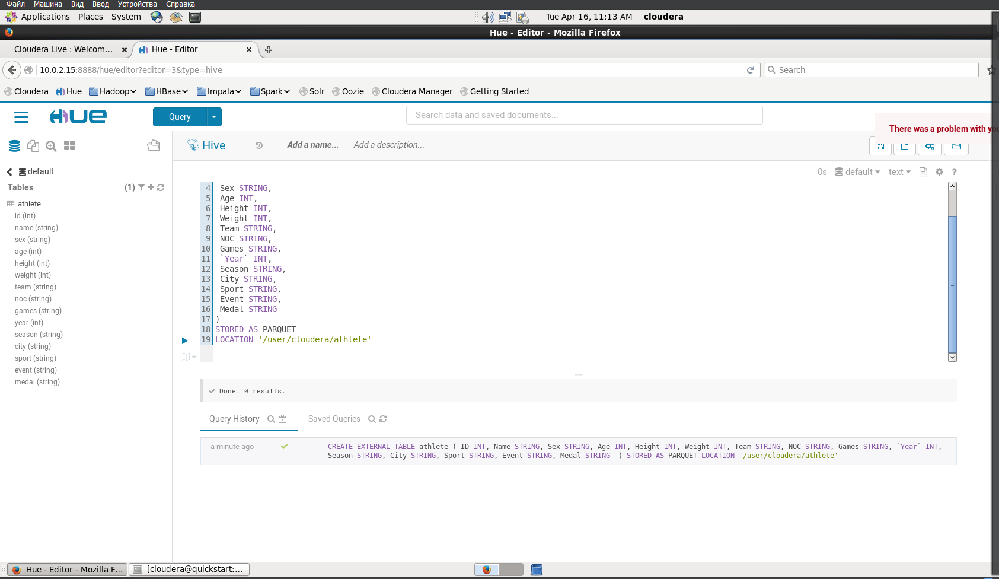

# Лабораторная работа 3.1.

3.1.1 Развернуть виртуальное окружение


3.1.2. Вывести с помощью команды help описание основных команд shell-клиента


3.1.3. Просмотреть корневую директорию HDFS


3.1.4. Создать в HDFS в директории /user/mgpu поддиректорию ваше_фио


3.1.5. Создать в локальной файловой системе случайный текстовый файл размером 10 Mb с 
именем, образованным вашими инициалами base64 /dev/urandom | head -c 10000000 > file.txt 


3.1.6. Заархивировать созданный текстовый файл gzip -c file.txt > file.gz 


3.1.7. Скопировать текстовый файл и архив в директорию /user/mgpu/fio HDFS виртуальной 
машины.


3.1.8. Просмотреть файл и архив с помощью утилит cat, text в комбинации с каналами 
и утилитами head, tail -- привести не менее 3 вариантов команд и просмотра файла.


3.1.9. Создать копию файла file.txt вида date_file.txt, где в начале имени файла-копии указана 
текущая дата. Вывести листинг.


3.1.10. Вывести статистику по директории /user/mgpu/fio виртуальной машины


3.1.11. Удалить поддиректорию /fio со всем содержимым.


3.1.12. Подсчитать количество слов в файле внутри HDFS с помощью методологии Map Reduce 
(размер файла не менее 128 Мб)


3.2 Создание таблицы в Hive

3.2.1. Скачать датасет или тут


3.2.2. Через HUE загрузите файл в папку /user/cloudera/athlete.

3.2.3. В навигационном меню выберите Files

3.2.4. Создайте папку

3.2.5. Загрузите файл в HDFS, нажав Upload


3.2.6. Перейдите в “Editor > Hive” и выполните запрос:
```sql
CREATE EXTERNAL TABLE athlete (
 ID INT,
 Name STRING,
 Sex STRING,
 Age INT,
 Height INT,
 Weight INT,
 Team STRING,
 NOC STRING,
 Games STRING,
 `Year` INT,
 Season STRING,
 City STRING,
 Sport STRING,
 Event STRING,
 Medal STRING 
)
STORED AS PARQUET
LOCATION '/user/cloudera/athlete'
```



3.3. Проанализировать и визуализировать данные с помощью Impala(высокоскоростной механизм 
запросов SQL) или Hive

3.3.1. Загрузить и разархивировать babs_open_data_year_1.zip


3.3.2. Перенести данные 201402_trip_data.csv в HDFS.


3.3.3. Создать таблицу в Hive с привязкой к внешним данным 201402_trip_data.csv.


3.3.4. выполнить запрос

```sql
select `startstation`, `endstation`, count(*) as trips 
from `default`.`201402_trip_data` 
group by `startstation`, `endstation` 
order by trips desc;

```


3.3.5 Создать гистограмму, щелкнув значок «Hue Bar»:
Установить ось X в качестве начальной станции, а ось Y — в качестве маршрута. Установить лимит 10.


3.3.6. Выгрузить результаты, выбрав CSV или Excel


